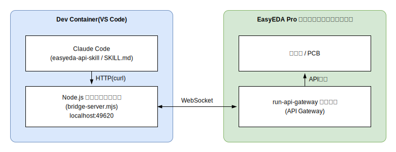

# 電力センサーモジュール基板設計

分電盤の各ブレーカーの電流をCTクランプで非接触測定し、ESPHome経由でHome Assistantに取り込むための基板を、EasyEDA ProとClaude Codeを連携させて設計するプロジェクト。

## ドキュメント

- [docs/spec.md](docs/spec.md) — 基板設計仕様書。構成部品、回路構成の要点、確定仕様、保留事項をまとめたもの
- [docs/bom.md](docs/bom.md) — 部品リスト(BOM)。LCSC部品番号・数量・調達メモ
- [docs/pcb-workflow.md](docs/pcb-workflow.md) — PCB作成〜JLCPCB発注までの作業手順
- [docs/easyeda-connection.md](docs/easyeda-connection.md) — EasyEDA Proとの接続方式まとめ(AIエージェント連携用)
- [firmware/esphome/esphome-sample.yaml](firmware/esphome/esphome-sample.yaml) — ESPHomeサンプル設定(ADS1115 + CTクランプ3chドラフト。12ch対応は今後拡張)
- [docs/calibration.md](docs/calibration.md) — 校正(キャリブレーション)の考え方と手順

## 構成概要

| 項目 | 内容 |
|---|---|
| マイコン | Seeed Studio XIAO ESP32C6 |
| ADコンバータ | ADS1115(16bit, 4ch)× 3(I2Cアドレス 0x48/0x49/0x4A) |
| センサー | CTクランプ SCT-013-000(YHDC)× 最大12(3.5mmジャック接続) |
| 負荷抵抗 | CN2〜12(15A用)=100Ω、CN1(主幹用)=39Ω(30A)か20Ω(60A)、各+50Ωか100Ωのトリマー(25回転)の直列 |
| バイアス | 10k/10k分圧+LMV358フォロワで1.65Vを12ch共有 |
| ファームウェア | ESPHome |
| 電源 | USB-C(または外部3.3Vパッド TP1/TP2) |
| 基板 | 2層基板、JLCPCB発注想定 |

### 接続図(回路ブロック)


詳細は [docs/spec.md](docs/spec.md) と [docs/bom.md](docs/bom.md) を参照。

## 開発環境

VS Code Dev Containers(`.devcontainer/`)で構築。コンテナ起動時に以下が利用可能になる:

- Node.js(EasyEDA連携ブリッジサーバー用)
- Claude Code拡張機能
- ポート `49620` を自動フォワード(EasyEDA API Gateway用)

### 接続構成



Claude Codeが `easyeda-api-skill`(SKILL.md)の指示に従いcurlでローカルのブリッジサーバーを呼び出し、ブリッジサーバーがWebSocketでEasyEDA Pro側の `run-api-gateway` 拡張機能と通信して回路図・PCBを操作する。

### 起動方法

1. VS Codeで本リポジトリを開き、"Reopen in Container" を選択
2. `.claude/skills/easyeda-api-skill` でブリッジサーバーを起動

   ```bash
   cd .claude/skills/easyeda-api-skill
   npm install
   npm run server
   ```

   もしくは VS Code の実行構成 `easyeda-api-skill: npm run server`([.vscode/launch.json](.vscode/launch.json))を使用

3. EasyEDA Pro デスクトップクライアント側に `run-api-gateway` 拡張機能を導入し、API Gatewayを接続
4. 接続確認

   ```bash
   curl http://localhost:49620/health
   curl http://localhost:49620/eda-windows
   ```

セットアップの詳細手順は [docs/easyeda-connection.md](docs/easyeda-connection.md) を参照。

## 現在のステータス

- ✅ 仕様確定(docs/spec.md)
- ✅ 回路図完成(EasyEDA: power-sensor-module、12ch構成、ネットリスト検証済み)
- ✅ 部品選定完了(受動部品はJLCPCB Basic Part化済み、docs/bom.md)
- ⏳ 次: PCBレイアウト(回路図→PCB転送、基板外形・部品配置・2層配線、JLCPCB標準ルール)

## ライセンス

[MIT License](LICENSE)
